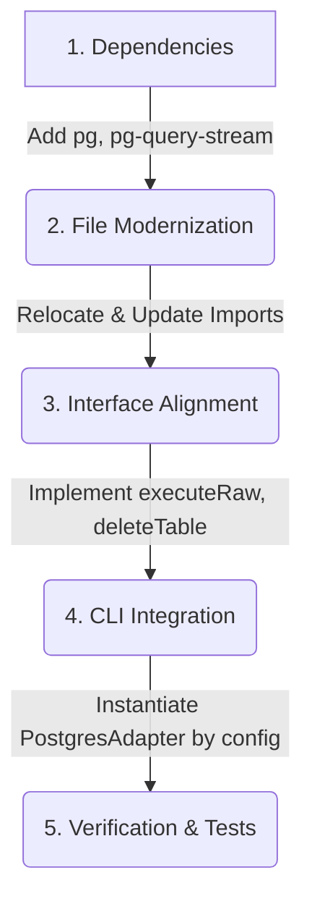

# Technical Assessment: PostgreSQL Reintegration in sqlanvil

> **SUPERSEDED.** Phase 3+ of this assessment is replaced by
> [`postgres_first_class_design.md`](postgres_first_class_design.md), which
> treats the Postgres adapter as first-class (idiomatic SQL generation, native
> action config blocks, dedicated SQL generator path) rather than a
> BigQuery-shaped adapter swap. Phases 1-2 (deps + relocation) below remain
> applicable; Phases 3-5 are re-scoped in the design doc.

This document provides a detailed technical assessment of what is required to re-integrate PostgreSQL database adapter support into the modern **sqlanvil** codebase using the old restored files.

---

## 1. Scope of Work Overview

The `restore-postgres-adapter` branch contains the raw restored files from git history. However, because Dataform was restructured (moving from a root `api/` layout to `cli/api/`), these files will not compile or run as-is.

Modernizing and fully integrating this adapter for use with **Supabase** will take approximately **1–2 days of engineering effort**. The work is broken down into five primary areas:



---

## 2. Step-by-Step Implementation Roadmap

### Phase 1: Dependency Restoration
Because the modern project uses no other external relational database clients (only BigQuery), the PostgreSQL drivers are completely missing from the lockfile.
1. **Modify `package.json`**:
   Add the following dependencies to the root [package.json](file:///Users/ivan/projects-ivan/sqlanvil/package.json):
   ```json
   "dependencies": {
     "pg": "^8.11.3",
     "pg-query-stream": "^4.5.3"
   },
   "devDependencies": {
     "@types/pg": "^8.11.0",
     "@types/pg-query-stream": "^4.0.0"
   }
   ```
2. **Re-install Dependencies**:
   Run `yarn install` at the root directory to generate a new `yarn.lock` and sync Bazel's `@npm` workspaces.

### Phase 2: File Modernization & Import Refactoring
The restored files are in the outdated `api/` directory and need to be relocated to the active CLI directories.
1. **Relocate Files**:
   * Move `api/dbadapters/postgres.ts` &rarr; `cli/api/dbadapters/postgres.ts`
   * Move `api/utils/postgres.ts` &rarr; `cli/api/utils/postgres.ts`
   * Delete the empty root-level `api/` folder.
2. **Update Path Mappings & Imports**:
   Update all imports in the relocated files to point to the `cli/` directories:
   * Replace `df/api/dbadapters/index` with `df/cli/api/dbadapters`.
   * Replace `df/api/utils/postgres` with `df/cli/api/utils/postgres`.
   * Replace `df/api/commands/credentials` with `df/cli/api/commands/credentials`.
   * Replace the `collectEvaluationQueries` import from `df/core/adapters` with `df/cli/api/dbadapters/execution_sql`.

### Phase 3: Interface Alignment
The restored `PostgresDbAdapter` must implement the modern `IDbAdapter` interface defined in [cli/api/dbadapters/index.ts](file:///Users/ivan/projects-ivan/sqlanvil/cli/api/dbadapters/index.ts).
1. **Implement `executeRaw`**:
   Add the `executeRaw` method to the Postgres adapter. Since PostgreSQL query results do not need complex nested unboxing (unlike BigQuery), it can directly map to `execute()`:
   ```typescript
   public async executeRaw(
     statement: string,
     options: { params?: { [name: string]: any }; rowLimit?: number } = { rowLimit: 1000 }
   ): Promise<IExecutionResultRaw> {
     // Convert named param object to a positional array for pg-driver if needed, or run standard query
     const result = await this.execute(statement, { 
       params: options.params ? Object.values(options.params) : undefined, 
       rowLimit: options.rowLimit 
     });
     return { ...result, schema: [] };
   }
   ```
2. **Implement `deleteTable`**:
   Add support for dropping views and tables using a transactional cascading drop:
   ```typescript
   public async deleteTable(target: dataform.ITarget): Promise<void> {
     const metadata = await this.table(target);
     if (!metadata) return;
     const type = metadata.type === dataform.TableMetadata.Type.VIEW ? "view" : "table";
     await this.execute(`drop ${type} if exists "${target.schema}"."${target.name}" cascade`, {
       includeQueryInError: true
     });
   }
   ```
3. **Align `schemas` and `tables` Signatures**:
   * Change `schemas()` to `schemas(database: string): Promise<string[]>` (ignore the `database` string, since PG is database-scoped).
   * Update `tables(database: string, schema?: string): Promise<dataform.ITableMetadata[]>` to recursively query metadata for each retrieved table using `this.table()`, returning an array of `dataform.ITableMetadata` instead of raw `dataform.ITarget[]`.

### Phase 4: CLI & Compilation Wiring
1. **Register in Bazel BUILD Rules**:
   Update `cli/api/BUILD` to include `postgres.ts` and `utils/postgres.ts` under the appropriate library targets.
2. **Wire in `cli/index.ts`**:
   Currently, the CLI in [cli/index.ts](file:///Users/ivan/projects-ivan/sqlanvil/cli/index.ts) explicitly creates a `BigQueryDbAdapter` on lines 349, 535, and 614.
   * Modify the instantiation logic to check the configured warehouse in the project's `dataform.json`:
     ```typescript
     let dbadapter: IDbAdapter;
     if (projectConfig.warehouse === "postgres") {
       dbadapter = await PostgresDbAdapter.create(finalCredentials);
     } else {
       dbadapter = new BigQueryDbAdapter(finalCredentials);
     }
     ```

### Phase 5: Modernizing Deprecated Subsystems
1. **SSHTunnelProxy Removal / Mitigation**:
   The old code references `SSHTunnelProxy` from `df/api/ssh_tunnel_proxy`, which was completely deleted in the modern version. 
   * **Recommendation for Supabase:** Since Supabase databases are securely accessible over public standard TCP ports with SSL, you do **not** need SSH tunneling. You should comment out or remove the SSH tunneling block entirely to keep the dependencies lean.
2. **Mock/Rewrite Error Parsing**:
   The old code imports `parseRedshiftEvalError` from `df/api/utils/error_parsing`, which is gone. Replace this import with a simple error formatter returning `{ message: String(error) }` in `cli/api/utils/error_parsing.ts`.

---

## 3. Estimated Effort & Risks

| Component | Difficulty | Est. Time | Key Risk |
| :--- | :--- | :--- | :--- |
| **1. Dependencies** | Easy | 1 hour | Bazel yarn-lock synchronizations |
| **2. File & Import Relocation** | Easy | 2 hours | Correct path mappings |
| **3. Interface Alignment** | Medium | 4 hours | Adapting old `tables()` to return full `ITableMetadata` |
| **4. CLI Integration** | Medium | 3 hours | Handling credentials parsing for JDBC vs BigQuery |
| **5. Testing & Verification** | Hard | 4-6 hours | Local docker/postgres fixture setup in Bazel sandbox |

> [!NOTE]
> Testing this locally within the Bazel environment requires a working local Docker installation so that `tools/postgres/postgres_fixture.ts` can fetch the `@postgres//image` and boot up a testing container inside the sandbox.
